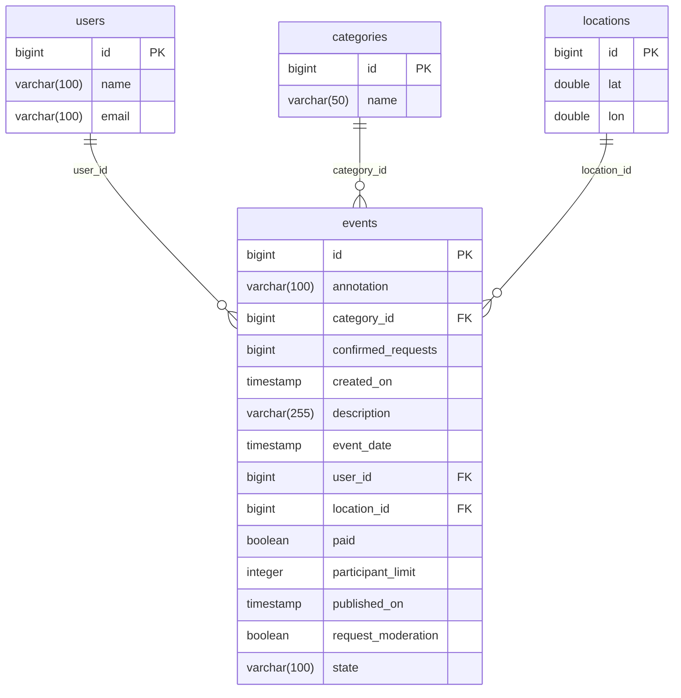
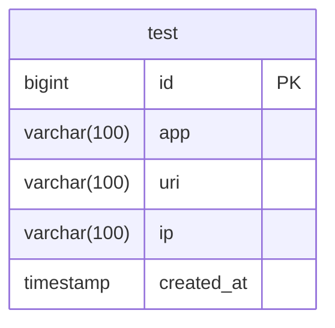

# java-explore-with-me

TEAM 1 PROJECT

## Main DB structure

## Stats DB structure

Development agreements:

1) Mappers generated by MapStruct
2) Link ONE Service to Many Repositories
3) All Common contants located in stats-service/stats-common/src/main/java/ru/practicum/Contants.java
4) Stats DTO located in stats-service/stats-common/src/main/java/ru/practicum
5) Tests should be implemented JsonTest, ControllerTest, ServiceTest, IntegrationTest (On Queries)