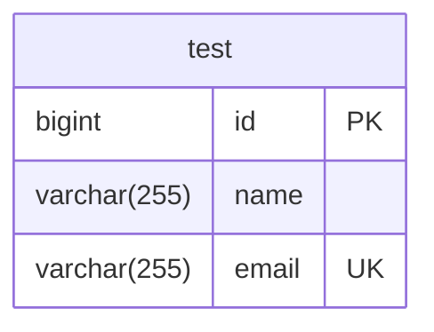

# java-explore-with-me
TEAM 1 PROJECT

## Stats DB structure

Development agreements:
1) Mappers generated by MapStruct
2) Link ONE Service to Many Repositories
3) Repository implementation via JPQL and @Query
4) All Common contants located in stats-service/stats-common/src/main/java/ru/practicum/Contants.java
5) Stats DTO located in stats-service/stats-common/src/main/java/ru/practicum
6) Tests should be implemented JsonTest, ControllerTest, ServiceTest, IntegrationTest (On Queries)